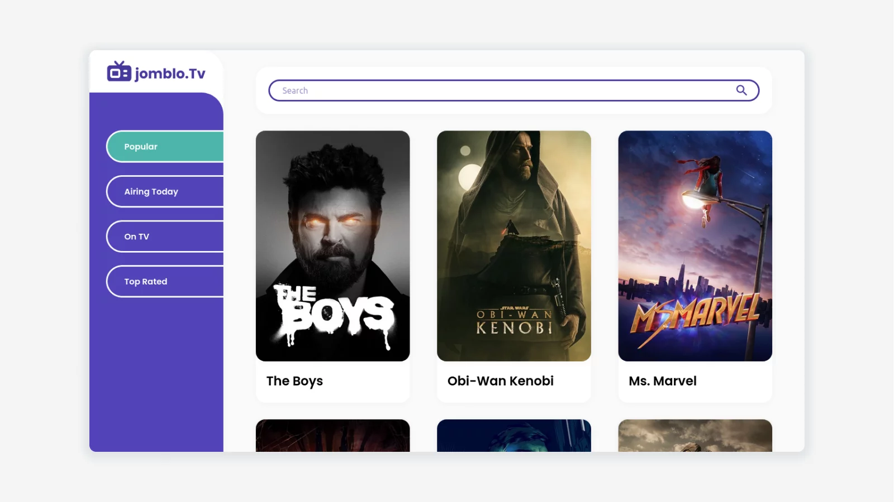

## About Project



This application is the final project of coding Front-End Developer Fundamentals. Which this final project must implement Webpack and Rest API.

Rest API source of this application comes from [themoviedb](https://www.themoviedb.org/).

[Demo App](https://herdianurdin.github.io/JombloTV-2021/)

## Getting Started

### Requirement
```sh
npm install npm@latest -g
```

### Installation
1. Clone the repo.

```sh
git clone https://github.com/herdianurdin/JombloTV-2021.git
```

2. Install NPM packages.

```sh
npm install
```

## Usage
### Run Project

```sh
npm run start-dev
```

### Build Project
```sh
npm run build
```

## License

Distributed under the GPL License. See [LICENSE](LICENSE) for more information.